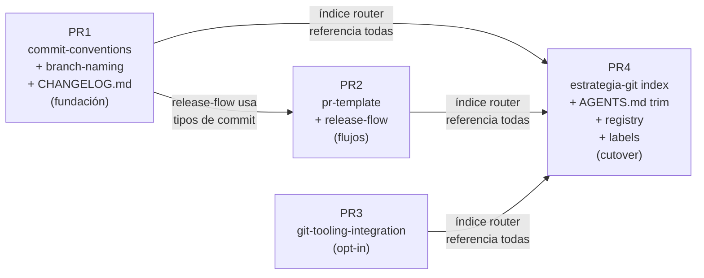

# Design: `estrategia-git-media-cleanup`

**Change**: `estrategia-git-media-cleanup`
**Base branch**: `develop` (verificado en `git ls-remote origin develop`)
**Delivery strategy**: 4 PRs encadenadas contra `develop`, presupuesto de revisión 400 líneas/PR
**Modo**: hybrid (OpenSpec + Engram)
**Idioma**: español, tono neutral/profesional (sin voseo, sin regionalismos)

---

## a) Visión general

Este change divide el skill monolítico `estrategia-git/SKILL.md` (632 líneas, 12 secciones H2) en cinco skills LLM-first dedicadas (`commit-conventions`, `branch-naming`, `pr-template`, `release-flow`, `git-tooling-integration`) y reduce `estrategia-git` a un índice router de ~90 líneas. La entrega se hace en cuatro PRs encadenadas contra `develop`, respetando el presupuesto de 400 líneas por PR: la PR1 establece las primitivas de política (commits + branches + bootstrap de `CHANGELOG.md`); la PR2 suma los flujos que las consumen (PR template + release flow); la PR3 introduce el meta-skill opt-in `git-tooling-integration` reescrito como plantilla stack-agnostic; la PR4 es el cutover que reescribe el índice, trimea `AGENTS.md` L1058-1087, actualiza el registry y crea `.github/labels.yml`. El orden importa: las PRs 1-3 son aditivas y pueden mergearse en cualquier sub-orden; la PR4 debe ser la última porque el índice router no puede apuntar a skills inexistentes.

---

## b) Estructura de archivos post-change

```
illa-skills/
├── commit-conventions/SKILL.md           # NUEVO, ~110 líneas (PR1)
├── branch-naming/SKILL.md                # NUEVO, ~110 líneas (PR1)
├── pr-template/SKILL.md                  # NUEVO, ~120 líneas (PR2)
├── release-flow/SKILL.md                 # NUEVO, ~120 líneas (PR2)
├── git-tooling-integration/SKILL.md      # NUEVO, ~140 líneas (PR3)
├── estrategia-git/SKILL.md               # REESCRITO, 632 → ~90 líneas (PR4)
├── AGENTS.md                             # trimeado L1058-1087, −25 líneas (PR4)
├── CHANGELOG.md                          # NUEVO, ~15 líneas (PR1)
├── .github/labels.yml                    # NUEVO, ~30 líneas (PR4)
├── .atl/skill-registry.md                # 1 entrada → 5 entradas, +15 líneas (PR4)
├── openspec/
│   ├── config.yaml                       # L6-7 corregidas, sin "husky/GGA" (PR4)
│   ├── specs/
│   │   ├── commit-conventions/spec.md         # 5 specs (PR1/PR2/PR3)
│   │   ├── branch-naming/spec.md
│   │   ├── pr-template/spec.md
│   │   ├── release-flow/spec.md
│   │   └── git-tooling-integration/spec.md
│   └── changes/estrategia-git-media-cleanup/
│       ├── exploration.md
│       ├── proposal.md
│       ├── design.md                       # este archivo
│       ├── tasks.md                        # PR4, sdd-tasks
│       ├── specs/
│       │   ├── estrategia-git/spec.md       # delta
│       │   └── AGENTS.md/spec.md            # delta
│       └── verify.md / archive.md          # fases posteriores
```

**Nota**: el archivo `estrategia-git/SKILL.md` también existe en `~/.pi/agent/skills/estrategia-git/SKILL.md` (entry de registry, L27) — el repo es la fuente de verdad y la skill global se regenera mediante el pipeline del registry. PR4 no toca el path global.

---

## c) Plan por PR

### PR1 — Foundation: `commit-conventions` + `branch-naming` + `CHANGELOG.md`

| Campo | Valor |
|---|---|
| **Título** | `feat(skills): add commit-conventions and branch-naming skills with CHANGELOG bootstrap` |
| **Archivos** | `commit-conventions/SKILL.md` (nuevo, ~110 líneas); `branch-naming/SKILL.md` (nuevo, ~110 líneas); `CHANGELOG.md` (nuevo, ~15 líneas) |
| **Δ líneas** | +235 (suma limpia, sin borrados) |
| **Dependencias** | Ninguna (PR fundacional) |
| **Target branch** | `develop` |

**Plan de verificación**:
1. Confirmar que cada `SKILL.md` arranca con frontmatter YAML-safe, `description` de una sola línea, ≤250 caracteres, con triggers discriminantes.
2. Contar tokens del cuerpo de cada skill (objetivo: 180-450, máximo duro 700). Si excede, trim.
3. Verificar la regex de validación de branch del spec `branch-naming` (`^(feat\|fix\|hotfix\|docs\|refactor\|perf\|test\|build\|ci\|chore\|revert)/[a-z0-9-]+$`) manualmente contra 5 nombres representativos: `feat/auth-google` (pasa), `feature/auth` (falla, sugiere `feat/auth`), `nueva-funcion` (falla), `sdd/change-id` (acepta por excepción documentada en L57-62 del spec), `hotfix/urgent-fix` (pasa).
4. `CHANGELOG.md`: confirmar sección inicial "Unreleased" con la lista de próximos cambios del change (cinco skills + índice reducido + AGENTS.md trim).
5. Commit message del PR debe ser Conventional Commits estricto — esta PR se evalúa a sí misma.

**Riesgos específicos**:
- El frontmatter con `description` multi-línea actual (`description: >`) del monolítico v2.0 es YAML legal pero los routers basados en regex de una línea fallan; en las dos skills nuevas, `description` debe ir entre comillas en una sola línea física.
- `CHANGELOG.md` introduce una convención mantenida por humanos. Si el repo no la respeta, la skill `release-flow` queda medio implementada; mitigación: la sección inicial lista los cambios concretos, no boilerplate.

---

### PR2 — Flows: `pr-template` + `release-flow`

| Campo | Valor |
|---|---|
| **Título** | `feat(skills): add pr-template and release-flow skills` |
| **Archivos** | `pr-template/SKILL.md` (nuevo, ~120 líneas); `release-flow/SKILL.md` (nuevo, ~120 líneas) |
| **Δ líneas** | +240 |
| **Dependencias** | PR1 mergeada (la skill `release-flow` referencia los tipos de commit de `commit-conventions` y los prefijos de `branch-naming`; spec `release-flow` L83 lo declara) |
| **Target branch** | `develop` |

**Plan de verificación**:
1. Verificar tabla tipo→label del spec `pr-template` (L37-46) manualmente: `feat` → `enhancement`, `fix` → `bug`, `feat(api)!` → `enhancement` + `breaking-change`. Confirmar que las labels listadas NO chocan con ninguna ya existente en el repo (el repo no tiene `.github/`, así que la verificación es contra el spec).
2. Para `release-flow`, ejecutar el escenario "Cálculo con breaking" del spec L40-42: dado `feat(api)!: change auth format` y `fix: token validation` desde `v1.4.2`, esperar `v2.0.0`. Hacer la cuenta a mano.
3. Verificar el escenario "Release sin CHANGELOG" (spec `release-flow` L60-64): la skill debe proponer crear `CHANGELOG.md` con sección inicial y NO bloquear el release. El `CHANGELOG.md` ya existe por PR1, así que el escenario real del repo requiere solo la entrada de la nueva versión.
4. Confirmar que `release-flow` Activation Contract (L14) bloquea uso para merges rutinarios a `develop` — debe ser específica para PRs de release, tags, semver.

**Riesgos específicos**:
- `release-flow` tiene una sección de Plantilla de PR de release (L66-74) que duplica estructura de `pr-template` (L20-26). Las dos skills deben compartir terminología ("Descripción", "Tipo de Cambio", "Checklist") para no divergir.
- El comando `git tag -a vX.Y.Z -m "..."` (spec L51) no se ejecuta en este repo (no hay tags); la verificación es a nivel de documentation review, no de ejecución.

---

### PR3 — Tooling opt-in: `git-tooling-integration` (stack-agnostic)

| Campo | Valor |
|---|---|
| **Título** | `feat(skills): add git-tooling-integration opt-in meta-skill` |
| **Archivos** | `git-tooling-integration/SKILL.md` (nuevo, ~140 líneas) |
| **Δ líneas** | +140 |
| **Dependencias** | Ninguna (skill independiente y opt-in, ver spec L80-90) |
| **Target branch** | `develop` |

**Plan de verificación**:
1. Confirmar que el frontmatter `description` contiene la palabra "opt-in" (spec L90) para evitar triggers accidentales.
2. Verificar el **banner obligatorio** del spec L6-8: la primera línea del cuerpo debe ser literal el texto "Plantilla para proyectos que adopten esta cadena... Este repositorio (`illa-skills`) NO la usa. No aplicar las plantillas aquí; son contenido de referencia para移植 a otros proyectos." (Nota: el spec tiene un carácter chino 移植 — confirmar transcripción o sustituir por "移植" → "移植" / equivalente castellano "trasladar" antes de PR3.)
3. Estructura interna (resolución #3 del orchestrator):
   - **Sección 1, banner explícito (≤15 líneas)**: "Template para proyectos que adopten este toolchain. Este repo NO lo usa."
   - **Sección 2, árbol de decisión (≤5 líneas)**: tres líneas sobre Node / Python / Go / Otro.
   - **Sección 3, patrones stack-agnostic (≤100 líneas)**: commitlint config genérico, pre-commit hook genérico, validación de Conventional Branch.
   - **Sección 4, 3 ejemplos de ecosistema (≤150 líneas, ≤50 cada uno)**: Node/Husky, Python/pre-commit, Go/golangci-git.
4. Verificar que NO aparecen referencias a `bun`, `apps/api`, `apps/web`, `PostgreSQL 16`, `Redis 7`, `oven-sh/setup-bun@v2` (verificación `grep` post-merge: `git grep -E 'bun|apps/api|PostgreSQL 16|Redis 7|oven-sh' -- 'git-tooling-integration/SKILL.md'` debe devolver cero resultados).
5. Verificar el escenario "Aplicación indebida en repo de solo docs" (spec L31-35): el árbol de decisión debe rechazar la carga cuando el proyecto es solo skills/docs.

**Riesgos específicos**:
- La transcripción del carácter chino 移植 en el spec L8 es un bug latente del spec. PR3 debe arreglarlo antes de mergear (sustituir por "trasladar" o reescribir la frase). Documentado en preguntas para `sdd-tasks`.
- Los 3 ejemplos de ecosistema pueden tener bugs sutiles en sintaxis de YAML (`indent pre-commit`), de shell script (Husky pre-push en Node 18+), o de Go (golangci-lint flags). Cada ejemplo debe ser revisable aislado: si un ejemplo tiene bug, los otros dos no deben arrastrarlo.
- Riesgo de "leakage": la skill opt-in puede terminar cargada por routers que hacen match en la palabra "Husky" del banner. Mitigación: el frontmatter debe ser lo más específico posible ("opt-in Husky + commitlint + GGA + GitHub Actions setup", evitar el verbo "use" en descripción).

---

### PR4 — Cutover: índice + AGENTS.md trim + registry + labels

| Campo | Valor |
|---|---|
| **Título** | `refactor(skills): collapse estrategia-git to router index and align cross-references` |
| **Archivos** | `estrategia-git/SKILL.md` (rewrite, 632 → ~90 líneas); `AGENTS.md` (trim L1058-1087, −25 líneas); `.atl/skill-registry.md` (1 → 5 entradas, +15 líneas); `openspec/config.yaml` (L6-7 corregidas, ±2 líneas); `.github/labels.yml` (nuevo, ~30 líneas) |
| **Δ líneas** | **−550 net** (rewrite −542 + registry +15 + config +2 + labels +30 − AGENTS −25) |
| **Dependencias** | PR1, PR2 y PR3 mergeadas (el índice referencia las cinco skills) |
| **Target branch** | `develop` |

**Plan de verificación**:
1. Contar líneas del nuevo `estrategia-git/SKILL.md` post-rewrite: ≤100 (spec `estrategia-git` delta L38).
2. Verificar el cuerpo reescrito contra la estructura exigida (spec delta L31-47): tabla de decisión, diagrama ASCII (≤6 líneas), 5 reglas universales, notas del repositorio (≤6 bullets). Ninguna subsección anidada más allá de las 4 (spec delta L39).
3. Verificar la versión bumped a `3.0` en frontmatter `metadata.version` (spec delta L86-89).
4. Verificar el banner de verdad sobre el repositorio (spec delta L91-93): el primer párrafo del cuerpo debe declarar la política vigente.
5. `AGENTS.md` L1058-1087: trimear bloque `### Commits` (L1068-1076) completo; trimear regla 6 "Husky" (L1085). Las cinco reglas restantes (L1080-1084) deben ser textual: `main is untouchable`, `develop is the base`, `Short-lived branches`, `Conventional Commits`, `No AI Attribution`. Añadir línea de referencia a las 5 skills (spec delta L49-54). Añadir pie `*v3.0 — alineado con la división de estrategia-git en cinco skills dedicadas.*` (spec delta L85-89).
6. `.atl/skill-registry.md`: reemplazar la entry de `estrategia-git` (L27) por 5 entries. Usar los triggers del spec: action-specific, sin la palabra "git" en el cuerpo. Verificación de no-solapamiento: ver tabla final (sección g).
7. `openspec/config.yaml` L6-7: eliminar la línea que dice `husky, GGA` y actualizar la referencia a `estrategia-git/SKILL.md v2.0` por `índice estrategia-git v3.0 + 5 skills dedicadas`.
8. `.github/labels.yml`: archivo nuevo. Contiene 9 labels del spec `pr-template` L37-46 (`enhancement`, `bug`, `documentation`, `refactor`, `performance`, `test`, `ci-cd`, `chore`, `revert`) + `breaking-change` + `sdd/*` (técnica) + `dependencies` (PRs que requieren otro PR). Total: 12 labels. Formato YAML estándar de GitHub.
9. `git grep -nE 'husky|GGA|git-c|oven-sh|setup-bun|apps/api prisma' -- 'AGENTS.md' 'estrategia-git/SKILL.md' 'openspec/config.yaml'` debe devolver cero resultados post-merge (excepto menciones deprecadas marcadas como histórico).

**Riesgos específicos**:
- AGENTS.md es el contrato de persona (always-loaded). El trim L1058-1087 cambia cómo cada sesión interpreta git. Riesgo ALTO: el usuario debe aprobar el diff antes de merge (propuesta R1).
- El rewrite del `estrategia-git/SKILL.md` es la única operación "destructiva" del change (632 → 90). Mitigación: el contenido borrado queda preservado en git history; `git show HEAD~1:estrategia-git/SKILL.md` siempre lo devuelve.
- `.atl/skill-registry.md` está auto-generado por `gentle-pi extensions/skill-registry.ts` (L3 del archivo). Si el pipeline corre antes de PR4 mergeada, puede sobrescribir las 5 entries nuevas. Mitigación: ejecutar el PR4 con `gentle-pi` desactivado o documentar el orden de merge + refresh.

---

## d) Grafo de dependencias entre PRs



**Notas**:
- PR1 es la única prerequisito de PR2 (PR2 puede mergearse en cualquier momento después de PR1).
- PR3 es independiente y puede mergearse en cualquier momento (incluso antes de PR1).
- PR4 es bloqueada por las tres anteriores; no puede mergearse hasta que las cinco skills dedicadas existan físicamente en `develop`.

---

## e) Plan de merge y cleanup

Cada PR sigue el flujo:

```bash
# Antes de abrir la PR
git checkout develop
git pull origin develop
git checkout -b feat/<nombre-pr>

# Trabajo + commits con Conventional Commits
# (la PR1 también sirve de caso de prueba de su propio skill)

# Push + PR
git push -u origin feat/<nombre-pr>
gh pr create --base develop --title "..." --body-file .github/PR_TEMPLATE.md

# Merge con --no-ff para preservar la historia del branch
gh pr merge --merge --delete-branch

# Limpieza local
git checkout develop
git pull origin develop
git branch -d feat/<nombre-pr>
```

Orden de merge: **PR1 → PR2 → PR3 → PR4**. PR3 puede intercambiarse con PR1 o PR2 en orden sin romper nada (skill independiente). PR4 siempre última.

Las branches `feat/*` se borran en origin (vía `gh pr merge --delete-branch`) y en local (vía `git branch -d`). Las tres branches dangling existentes (`chore/opencode-bootstrap`, `docs/estrategia-git-cleanup`, `sdd/estrategia-git-media-cleanup`) son **out of scope** (propuesta sección Out of Scope); el orchestrator las gestionará por separado tras el merge de PR4.

---

## f) Plan de rollback

| Escenario | Reversión | Pérdida de datos |
|---|---|---|
| **PR1 falla en review** | Cerrar PR sin mergear. Las dos skills no entran al repo. | Cero (cambios aditivos en branch). |
| **PR1 mergeada y缺陷 (defect) encontrado** | `git revert -m 1 <merge-sha>` en `develop` o `gh pr revert` si GitHub lo soporta. Las dos skills se borran; el `CHANGELOG.md` se borra o se mantiene si el usuario lo prefiere. | Cero (revert deja las skills en git history). |
| **PR2 falla** | Idem PR1. | Cero. |
| **PR3 falla** | Idem. La skill opt-in no afecta otras skills. | Cero. |
| **PR4 falla (cutover parcial)** | `git revert -m 1 <merge-sha>` en `develop`. `estrategia-git/SKILL.md` vuelve a 632 líneas (rescatable de `HEAD~1:estrategia-git/SKILL.md` antes del revert), `AGENTS.md` recupera la sección Git Strategy original, registry pierde las 5 entries, `.github/labels.yml` se borra. | Cero (las cinco skills dedicadas sobreviven en `develop` aunque el índice no las apunte; pueden ser referenciadas manualmente o re-vinculadas en un PR posterior). |
| **PR4 mergeada y缺陷 crítico encontrado** | `git revert -m 1 <merge-sha>` + cherry-pick del revert si el bug es en el índice solamente. Considerar cherry-pick reverso de los 4 archivos modificados como alternativa al revert completo. | Cero. |

**Mitigación clave**: el cutover de PR4 es la única operación que toca archivos previamente existentes (`estrategia-git/SKILL.md`, `AGENTS.md`, `.atl/skill-registry.md`, `openspec/config.yaml`). Las cinco skills dedicadas viven en su propio path, son aditivas, y sobreviven a cualquier revert de PR4. Esta es la razón estructural de la estrategia encadenada.

---

## g) Tabla final de triggers del registry

Las cinco entries (cuatro nuevas + el índice `estrategia-git` reducido) usan **triggers action-specific sin la palabra "git"** (resolución #6 del orchestrator + spec `estrategia-git` delta L17-29). Verificación manual de no-solapamiento contra el spec `commit-conventions` (L13-15), `branch-naming` (L13-15), `pr-template` (L13-14), `release-flow` (L13-14) y `git-tooling-integration` (L17-18, L88-90):

| Skill | Trigger / description (entry de registry) | Path |
|---|---|---|
| `commit-conventions` | Conventional Commits, mensaje de commit, formato de commit, breaking change marker, body y footer de commit. Trigger: cuando hay que redactar, validar o explicar el mensaje de un commit. | `commit-conventions/SKILL.md` |
| `branch-naming` | Branch name, nombre de rama, prefijo de tipo, kebab-case, slug de rama, validación pre-push. Trigger: cuando hay que crear, renombrar o validar el nombre de una rama. | `branch-naming/SKILL.md` |
| `pr-template` | Pull request body, PR template, labels por tipo, regla issue-first, checklist del revisor. Trigger: cuando hay que abrir, preparar, revisar o mergear un PR. | `pr-template/SKILL.md` |
| `release-flow` | Release PR, versionado semver, tag anotado, changelog. Trigger: cuando hay que preparar un PR de release, calcular la siguiente versión, crear/verificar tags, o proponer entradas de changelog. | `release-flow/SKILL.md` |
| `git-tooling-integration` | Opt-in. Husky + commitlint setup, GGA hook, git-c script, GitHub Actions CI template. Trigger: cuando hay que inicializar hooks de git, configurar validación de Conventional Commits, integrar GGA/revisor automático, o plantear un workflow de CI (solo si el proyecto tiene código de aplicación real, no docs-only). | `git-tooling-integration/SKILL.md` |
| `estrategia-git` (índice) | Router de la estrategia git. Trigger: cuando no sepas cuál de las cinco skills dedicadas aplica (commit, rama, PR, release, tooling). Cargar esta entry solo para orientación; redirige a la skill específica. | `estrategia-git/SKILL.md` |

**Chequeo de no-solapamiento** (verificación manual fila por fila):
- `commit-conventions` menciona "commit" y "breaking change" → no choca con `branch-naming` (rama/slug), `pr-template` (PR/labels), `release-flow` (tag/release), ni `git-tooling-integration` (hooks/CI).
- `branch-naming` menciona "rama", "kebab-case" → no choca con las otras.
- `pr-template` menciona "pull request", "labels", "revisor" → no choca con `release-flow` (release/tag) ni `commit-conventions` (commit).
- `release-flow` menciona "release", "tag", "changelog", "semver" → no choca con `pr-template` (PR genérico) ni con las otras.
- `git-tooling-integration` menciona "Husky", "GGA", "git-c", "GitHub Actions" → opt-in por "Opt-in" en el trigger y por la cláusula "solo si el proyecto tiene código de aplicación real".
- `estrategia-git` (índice) menciona "router" + "cinco skills dedicadas" → no compite porque redirige explícitamente.

**Sin overlap con entries existentes en el registry** (L22-51): la entry de `branch-pr` (L22) habla de "issue-first checks" y es ortogonal a `pr-template` (que es la skill de contenido; `branch-pr` es la del workflow de creación). No se renombra `branch-pr`. La entry de `work-unit-commits` (L51) es sobre commits como unidades de revisión, no sobre el formato del mensaje — ortogonal a `commit-conventions`.

---

## h) Riesgos técnicos

1. **AGENTS.md L1058-1087 es el contrato de persona** (always-loaded en cada sesión de Pi/opencode). El trim cambia cómo cada agente interpreta git. Mitigación: las cinco reglas restantes (persona contract) son textual; el bloque "Commits" eliminado va a `commit-conventions`; la regla 6 "Husky" eliminada es porque el repo no tiene Husky. El diff debe ser user-visible antes de merge. **Severidad: ALTA**.

2. **El spec `git-tooling-integration` L8 contiene un carácter chino 移植** que es un bug del spec, no de la skill. La skill final en PR3 debe arreglarlo (sustituir por "trasladar" o reescribir la frase). Si no se corrige, el banner de la skill queda con mojibake potencial en pipelines que asumen ASCII. **Severidad: MEDIA**.

3. **El cutover de PR4 (−550 net, 5 archivos tocados, 1 rewrite grande) es la PR más riesgosa** porque toca el contrato de persona, el archivo de 632 líneas, y el registry auto-generado. Mitigación: review dedicado (no se apila con otras PRs); checklist de verificación de 9 puntos (sección c-PR4); `.atl/skill-registry.md` puede requerir ejecución manual del pipeline `gentle-pi` post-merge. **Severidad: ALTA**.

4. **`openspec/config.yaml` L6-7 menciona "husky, GGA"** como parte del proyecto. Si PR4 corrige esta línea pero el `gentle-pi` regenerate corre antes con el `config.yaml` viejo, se reintroduce la inconsistencia. Mitigación: PR4 incluye el cambio de `config.yaml` en el mismo commit que el rewrite del índice. **Severidad: BAJA-MEDIA**.

5. **El banner de la skill `git-tooling-integration` puede romper routers** que hacen match de palabra ("Husky") sin chequear la cláusula "opt-in". Si el router del orchestrator carga la skill en sesiones de docs (este repo), la skill es instructivamente inofensiva (dice "no aplicar") pero consume tokens. Mitigación: la entry de registry usa "Opt-in" como primer trigger y un calificador de proyecto ("solo si código de aplicación real"). **Severidad: BAJA**.

6. **`CHANGELOG.md` introducido en PR1 es una convención mantenida por humanos**. Si nadie lo actualiza tras el cutover, el spec `release-flow` (L57) queda medio implementado. Mitigación: PR1 añade una sección "Unreleased" con la lista de cambios del change, y PR4 la cierra con la entrada "v3.0 — split en cinco skills". Aceptar que después del change, la convención es voluntaria. **Severidad: BAJA**.

---

## Decisiones de arquitectura (cumpliendo `config.yaml` L18 `design.require_tradeoffs: true`)

| Decisión | Alternativa rechazada | Rationale |
|---|---|---|
| **Estrategia 4 PRs encadenadas** | Single PR de 9 archivos / +50 net | Chained PR respeta el budget de 400 líneas/PR, separa concerns (policy primitive → flow → tool → cutover), permite review dedicado al AGENTS.md trim. Single PR excede cognitive-load guidance del orchestrator (9 archivos / 5 áreas). |
| **CHANGELOG.md en PR1** (no en PR2 con `release-flow`) | Crear CHANGELOG cuando se implemente release-flow (PR2) | El spec `release-flow` L57 declara la convención; sin el archivo, la skill queda medio implementada desde PR1. Una línea de código, 0 riesgo, sin dependencias. |
| **5th skill `git-tooling-integration` (no drop toolchain content)** | Eliminar el contenido de toolchain (Approach A de la exploración) | El usuario confirmó (sdd-propose) que el contenido se conserva como plantilla opt-in. Reescribir como stack-agnostic elimina la deuda de "describe infra que no existe" sin perder el conocimiento. |
| **`.github/labels.yml` en PR4** (no en PR1 ni PR2) | Crear labels con la primera PR que las necesite | Las labels son referenciadas por `pr-template` (spec L37-46); el archivo se crea junto al cutover que actualiza el contrato. Crear antes rompe el orden de dependencias. |
| **PR2 depende de PR1** (no en paralelo) | PR1 y PR2 en paralelo desde develop | `release-flow` referencia tipos de commit (`commit-conventions`) y prefijos (`branch-naming`); si los tipos cambian en PR1 post-merge, PR2 puede quedar inconsistente. PR1 primero elimina ese riesgo. |
| **PR3 sin dependencia de PR1/PR2** | PR3 después de PR1+PR2 para "ordenar narrativamente" | La skill es opt-in e independiente; bloquearla por narrativa agrega latencia sin reducir riesgo. Se permite PR3 en cualquier posición del 1-2-3. |
| **Triggers de registry action-specific sin la palabra "git"** | Triggers con "git strategy", "git workflow", "git policy" | El spec `estrategia-git` delta L19-22 lo exige para evitar colisión trivial con la entry del índice. Verificación manual de no-solapamiento en sección g. |
| **Banner literal del spec `git-tooling-integration` L6-8 (con corrección del carácter chino)** | Banner reescrito libre | El spec es contract; reescribir el banner cambiaría el alcance. La corrección del carácter chino 移植 → "trasladar" se hace en PR3 y se documenta en preguntas para sdd-tasks. |

---

## Open Questions para `sdd-tasks`

1. **Carácter chino 移植 en spec `git-tooling-integration` L8**: ¿sdd-tasks debe arreglar el spec antes de PR3, o el fix se hace dentro de PR3 mismo? Recomendación: arreglar el spec en una corrección menor previa; PR3 aplica el spec corregido.
2. **`.atl/skill-registry.md` auto-generado**: ¿el orchestrator debe correr `gentle-pi extensions/skill-registry.ts` después de merge de PR4, o el PR4 incluye el archivo ya reescrito a mano? El header del archivo (L3) dice "Auto-generated by gentle-pi extensions/skill-registry.ts". Si la pipeline corre antes de merge, sobrescribe. Recomendación: PR4 incluye el rewrite a mano y se documenta el orden; sdd-verify chequea que el archivo final contiene las 5 entries.
3. **Tres branches dangling pre-existentes** (`chore/opencode-bootstrap`, `docs/estrategia-git-cleanup`, `sdd/estrategia-git-media-cleanup`): la propuesta las declara out of scope. ¿sdd-tasks las lista en un TODO post-change, o las borra en PR4? Recomendación: TODO post-change; el orchestrator pregunta al usuario tras el merge.
4. **Orden de merge de PR1 y PR3**: ¿se permite PR3 antes de PR1 (skill independiente), o se fuerza PR1→PR2→PR3→PR4? Recomendación: permitir cualquier permutación de PR1/PR2/PR3; PR4 siempre última. sdd-tasks debe explicitar esta flexibilidad.
5. **`local main` muestra "ahead 2" de `origin/main`** (rama local y origin divergentes): el `sdd-design` lo nota pero no bloquea. El flujo de PRs va contra `develop`. ¿sdd-tasks debe sincronizar `main ← develop` al final, o se deja para housekeeping futuro? Recomendación: post-change, el orchestrator pregunta al usuario.

---

## Artefactos OpenSpec del change

- `openspec/changes/estrategia-git-media-cleanup/exploration.md` (existe)
- `openspec/changes/estrategia-git-media-cleanup/proposal.md` (existe)
- `openspec/changes/estrategia-git-media-cleanup/design.md` (este archivo)
- `openspec/changes/estrategia-git-media-cleanup/specs/estrategia-git/spec.md` (existe, delta)
- `openspec/changes/estrategia-git-media-cleanup/specs/AGENTS.md/spec.md` (existe, delta)
- `openspec/specs/commit-conventions/spec.md` (existe)
- `openspec/specs/branch-naming/spec.md` (existe)
- `openspec/specs/pr-template/spec.md` (existe)
- `openspec/specs/release-flow/spec.md` (existe)
- `openspec/specs/git-tooling-integration/spec.md` (existe)
- `openspec/changes/estrategia-git-media-cleanup/tasks.md` (sdd-tasks, próxima fase)
- `openspec/changes/estrategia-git-media-cleanup/verify.md` (sdd-verify, post-apply)
- `openspec/changes/estrategia-git-media-cleanup/archive.md` (sdd-archive, cierre)
