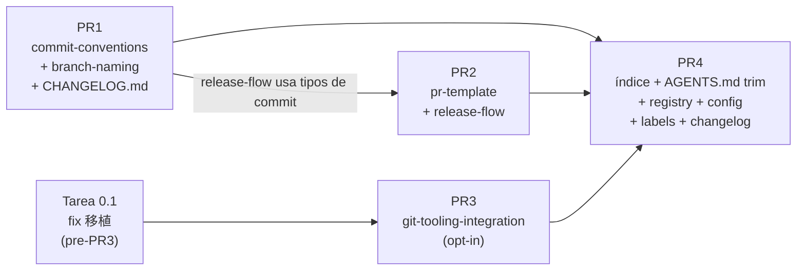

# Tasks: `estrategia-git-media-cleanup`

**Change**: `estrategia-git-media-cleanup`
**Base branch**: `develop` (verificada en `origin/develop`, SHA `dc29b8bcc72a920c92c59753db446520a009f4b5`)
**Estrategia de entrega**: 4 PRs encadenadas contra `develop` (presupuesto 400 líneas/PR)
**Modo**: hybrid (OpenSpec + Engram)
**Idioma**: español, tono neutral/profesional
**Fecha**: 2026-06-03

---

## Review Workload Forecast

| Campo | Valor |
|---|---|
| Δ líneas total estimado | ~+65 net (PR1 +235, PR2 +240, PR3 +140, PR4 −550) |
| Riesgo 400-line/PR | Bajo (PR4 es mayormente borrado, los otros tres son aditivos y dentro de presupuesto) |
| PRs encadenadas | Sí |
| Split sugerido | Tarea 0.1 (pre-PR3) → PR1 (fundación) → PR2 (flujos) → PR3 (tooling) → PR4 (cutover) |
| Delivery strategy | ask-on-risk (usuario confirmó 4-PR encadenadas en `sdd-propose`) |
| Chain strategy | feature-branch-chain con base = `develop` para cada PR; PR4 depende de las tres anteriores |

Decision needed before apply: No
Chained PRs recommended: Yes
Chain strategy: feature-branch-chain
400-line budget risk: Low

### Suggested Work Units

| Unidad | Meta | PR | Notas |
|---|---|---|---|
| 0.1 | Fix del carácter chino `移植` en spec `git-tooling-integration` | Pre-PR3 | Limpia el bug latente antes de que la skill final copie el banner |
| 1 | `commit-conventions` + `branch-naming` + `CHANGELOG.md` | PR1 | Fundación aditiva; valida Conventional Commits contra sí misma |
| 2 | `pr-template` + `release-flow` | PR2 | Depende de PR1 (release-flow referencia tipos de commit) |
| 3 | `git-tooling-integration` (plantilla stack-agnostic) | PR3 | Independiente; puede permutarse con PR1/PR2; depende de 0.1 |
| 4 | Cutover: `estrategia-git` índice + trim `AGENTS.md` + registry + `openspec/config.yaml` + `.github/labels.yml` + cierre `CHANGELOG.md` | PR4 | Última; el índice router no puede apuntar a skills inexistentes |

---

## Resoluciones locked-in (5 open questions delegadas)

1. **Carácter chino `移植` en spec L8**: se arregla en Tarea 0.1 (fix del spec) **antes de PR3**, no dentro de PR3. Sustituir por "trasladar" en la frase del banner obligatorio.
2. **`.atl/skill-registry.md` auto-generado por `gentle-pi`**: PR4 hace el rewrite a mano (control de diff). El pipeline puede correr post-merge sin sobrescribir (porque ya matchea). Documentado en Tarea 4.3.
3. **Branches dangling pre-existentes** (`chore/opencode-bootstrap`, `docs/estrategia-git-cleanup`, `sdd/estrategia-git-media-cleanup`): **TODO post-change**, no en PR4. El orchestrator preguntará al usuario tras el merge de PR4.
4. **Orden de merge PR1 vs PR3**: PR3 puede mergear antes que PR1 (skill independiente). PR2 necesita PR1. PR4 siempre última. Secuencia flexible para PR1/PR2/PR3 mientras se respete PR4 al final.
5. **`local main ahead 2` vs `origin/main`**: post-change sync, **fuera del scope** de tasks. El orchestrator preguntará al usuario tras el merge completo.

---

## Grafo de dependencias entre PRs



PR3 puede intercambiarse con PR1/PR2 sin romper nada (skill independiente). PR4 siempre última.

---

## Fase 0 — Pre-PR3: fix de bug latente

### 0.1 Fix del carácter chino `移植` en spec `git-tooling-integration`

- **Archivos**: `openspec/specs/git-tooling-integration/spec.md` (L8, banner obligatorio)
- **Δ**: ~2 líneas modificadas, 0 net
- **Cambio concreto**: reemplazar la cadena `移植` (carácter chino) por la palabra castellana "trasladar". Frase final: `"...son contenido de referencia para trasladar a otros proyectos."`
- **Acceptance criteria**:
  - `python3 -c "import re; data=open('openspec/specs/git-tooling-integration/spec.md').read(); print(re.findall(r'[\u4e00-\u9fff]+', data))"` retorna `[]`
  - El banner conserva su sentido literal (la skill sigue declarando que es plantilla y que no aplica a este repo)
  - Sin cambios fuera de L8
- **Commit**: `docs(specs): fix encoding glitch in git-tooling-integration banner`

**Notas de ejecución**:
- Este commit puede ir directo a `develop` como housekeeping, o dentro de la rama de PR3. Recomendado: rama propia `fix/spec-chinese-char` para que el diff de PR3 no incluya la corrección.
- Branch sugerido: `fix/spec-chinese-char` (cumple `branch-naming` spec).

---

## PR1 — Foundation: `commit-conventions` + `branch-naming` + `CHANGELOG.md`

**Target branch**: `develop`
**Branch de feature**: `feat/skills-foundation-pr1`
**Δ estimada**: +235 (110 + 110 + 15)

### Tarea 1.1 Crear skill `commit-conventions`

- **Archivos**: `commit-conventions/SKILL.md` (NUEVO, ~110 líneas)
- **Estructura LLM-first obligatoria**:
  - Frontmatter YAML-safe: `description` de una sola línea física, entre comillas, ≤250 chars, con triggers discriminantes ("conventional commit, mensaje de commit, formato de commit, breaking change marker, body y footer de commit")
  - `metadata.version: "1.0"`
  - Secciones: `## Activation Contract`, `## Hard Rules` (formato, tipos, breaking, atomicidad, no-AI-Attribution), `## Decision Gates`, `## Execution Steps`, `## Output Contract`, `## References`
- **Acceptance criteria**:
  - `python3 -c "import yaml; yaml.safe_load(open('commit-conventions/SKILL.md').read().split('---')[1])"` retorna sin error
  - `description` es una sola línea (no `description: >`), ≤250 chars
  - Sin tabla de tipos exhaustiva (referenciar al spec en su lugar; ≤450 tokens de cuerpo)
  - Sin referencias a infra inexistente (no `husky`, no `bun`, no `oven-sh`)
- **Commit**: `feat(skills): add commit-conventions spec`

### Tarea 1.2 Crear skill `branch-naming`

- **Archivos**: `branch-naming/SKILL.md` (NUEVO, ~110 líneas)
- **Estructura**: misma plantilla LLM-first que 1.1
- **Contenido mínimo obligatorio**:
  - Tabla de 11 prefijos (`feat/`, `fix/`, `hotfix/`, `docs/`, `refactor/`, `perf/`, `test/`, `build/`, `ci/`, `chore/`, `revert/`)
  - Regex de validación: `^(feat|fix|hotfix|docs|refactor|perf|test|build|ci|chore|revert)/[a-z0-9-]+$`
  - Excepciones documentadas: `main`, `master`, `develop`, `release/*`, `sdd/<change-id>`
  - ≥3 ejemplos buenos y ≥3 malos (incluye casos del spec: `feat/auth-google-login` ✅, `feature/auth` ❌, `sdd/estrategia-git-media-cleanup` ✅ por excepción, `nueva-funcion` ❌)
  - Slug kebab-case: `[a-z0-9-]`, 3–60 chars
- **Acceptance criteria**:
  - Regex presente y testeable (un LLM puede correrla mentalmente contra los 5 ejemplos del design L69)
  - Frontmatter `description` con triggers: "branch name, nombre de rama, prefijo de tipo, kebab-case, slug de rama, validación pre-push"
  - Sin la palabra "git" en el cuerpo (trigger action-specific)
- **Commit**: `feat(skills): add branch-naming spec`

### Tarea 1.3 Crear `CHANGELOG.md` con sección inicial

- **Archivos**: `CHANGELOG.md` (NUEVO, ~15 líneas)
- **Formato**: Keep a Changelog 1.1.0
- **Contenido**:
  - Encabezado estándar (`# Changelog`, `All notable changes...`, `The format is based on [Keep a Changelog]`, `[SemVer]: https://semver.org/`)
  - Sección `## [Unreleased]` con subsección `### Added` listando los 5 próximos cambios del change: las cinco skills dedicadas (`commit-conventions`, `branch-naming`, `pr-template`, `release-flow`, `git-tooling-integration`), la reducción de `estrategia-git` a router, y el trim de `AGENTS.md`
- **Acceptance criteria**:
  - `CHANGELOG.md` commiteado en raíz
  - Sección "Unreleased" lista los próximos cambios concretos
  - Formato markdown válido (renderiza en GitHub)
- **Commit**: `docs(changelog): bootstrap with Unreleased section`

**Plan de ejecución PR1**:

```bash
git checkout develop
git pull origin develop
git checkout -b feat/skills-foundation-pr1

# Trabajo + 3 commits (uno por tarea, en orden 1.1 → 1.2 → 1.3)
git add commit-conventions/SKILL.md
git commit -m "feat(skills): add commit-conventions spec"
git add branch-naming/SKILL.md
git commit -m "feat(skills): add branch-naming spec"
git add CHANGELOG.md
git commit -m "docs(changelog): bootstrap with Unreleased section"

git push -u origin feat/skills-foundation-pr1
gh pr create --base develop \
  --title "feat(skills): add commit-conventions and branch-naming skills with CHANGELOG bootstrap" \
  --body "## Resumen
- Crea \`commit-conventions\` (Conventional Commits, tipos, breaking changes, atomicidad, no-AI-Attribution)
- Crea \`branch-naming\` (11 prefijos, regex, excepciones, ejemplos buenos/malos)
- Bootstrap de \`CHANGELOG.md\` con sección Unreleased listando los próximos cambios del change

## Verificación
- \`wc -l commit-conventions/SKILL.md branch-naming/SKILL.md\` retorna ~110 cada uno
- Frontmatter YAML-safe, description de una línea ≤250 chars
- Cero referencias a infra inexistente (\`husky|bun|oven-sh|GGA\` retorna 0 con grep)

Closes sdd/estrategia-git-media-cleanup → PR1."

gh pr merge --merge --delete-branch
git checkout develop && git pull && git branch -d feat/skills-foundation-pr1
```

**Verificación post-merge PR1**:

```bash
git ls-files | grep -E '^(commit-conventions|branch-naming)/SKILL.md$'  # 2 paths
test -f CHANGELOG.md && echo "OK"
grep -E 'husky|bun|oven-sh|GGA' commit-conventions/SKILL.md branch-naming/SKILL.md  # 0 results
```

---

## PR2 — Flows: `pr-template` + `release-flow`

**Target branch**: `develop`
**Branch de feature**: `feat/skills-flows-pr2`
**Δ estimada**: +240 (120 + 120)
**Depende de**: PR1 mergeada (release-flow referencia tipos de commit de `commit-conventions` y prefijos de `branch-naming`)

### Tarea 2.1 Crear skill `pr-template`

- **Archivos**: `pr-template/SKILL.md` (NUEVO, ~120 líneas)
- **Estructura**: LLM-first estándar
- **Contenido mínimo obligatorio**:
  - 5 secciones del cuerpo del PR en orden: Descripción, Tipo de Cambio (11 tipos), Breaking Changes, Checklist de calidad, Referencias
  - Mapeo tipo→label (tabla del spec L37-46): `feat`→`enhancement`, `fix`→`bug`, etc.
  - Regla issue-first: exigir `Closes #<n>` o `Refs #<n>` antes de abrir
  - Checklist del revisor (6 puntos: arquitectura, tests, sin `console.log`, docs, sin secretos, Conventional Commits)
  - Política de merge: squash (default), merge commit (semántico), rebase (1-2 commits)
  - Borrado de rama post-merge
- **Acceptance criteria**:
  - Tabla tipo→label completa (9 entradas: 8 tipos + `build`/`ci`→`ci-cd`)
  - Frontmatter `description` con triggers: "pull request body, PR template, labels por tipo, regla issue-first, checklist del revisor"
  - Sin la palabra "git" en el cuerpo
- **Commit**: `feat(skills): add pr-template spec`

### Tarea 2.2 Crear skill `release-flow`

- **Archivos**: `release-flow/SKILL.md` (NUEVO, ~120 líneas)
- **Estructura**: LLM-first estándar
- **Contenido mínimo obligatorio**:
  - Modelo de integración: `main` ← `develop`; `hotfix/*` puede ramificar directo a `main` con backport
  - Versionado semver con escenarios: breaking → MAJOR, feat → MINOR, solo fix/docs → PATCH
  - Tags anotados `vMAJOR.MINOR.PATCH` con `git tag -a vX.Y.Z -m "..."`
  - Convención CHANGELOG (formato Keep a Changelog 1.1.0; mencionar que ya existe en este repo desde PR1)
  - Plantilla de PR de release (4 secciones: versión propuesta, resumen ejecutivo, cambios por tipo, checklist)
  - Regla de bloqueo: NO cargar para merges rutinarios a `develop` ni para hotfixes directos
- **Acceptance criteria**:
  - Escenario "Cálculo con breaking" verificable manualmente: `feat(api)!: change auth format` + `fix: token validation` desde `v1.4.2` → `v2.0.0` ✅
  - Frontmatter `description` con triggers: "release PR, versionado semver, tag anotado, changelog"
  - Sin la palabra "git" en el cuerpo
  - Cross-ref a `commit-conventions` y `branch-naming` en la sección "References"
- **Commit**: `feat(skills): add release-flow spec`

**Plan de ejecución PR2**:

```bash
git checkout develop && git pull
git checkout -b feat/skills-flows-pr2

git add pr-template/SKILL.md && git commit -m "feat(skills): add pr-template spec"
git add release-flow/SKILL.md && git commit -m "feat(skills): add release-flow spec"

git push -u origin feat/skills-flows-pr2
gh pr create --base develop \
  --title "feat(skills): add pr-template and release-flow skills" \
  --body "## Resumen
- \`pr-template\`: 4 secciones obligatorias, tabla tipo→label, regla issue-first, checklist del revisor
- \`release-flow\`: develop→main, semver con escenarios, tags anotados, convención CHANGELOG

## Dependencias
Requiere PR1 mergeada (release-flow referencia tipos de commit y prefijos de branch).

Closes sdd/estrategia-git-media-cleanup → PR2."

gh pr merge --merge --delete-branch
git checkout develop && git pull && git branch -d feat/skills-flows-pr2
```

**Verificación post-merge PR2**:

```bash
git ls-files | grep -E '^(pr-template|release-flow)/SKILL.md$'  # 2 paths
grep -c "Closes #" pr-template/SKILL.md release-flow/SKILL.md  # ≥1 cada uno
```

---

## PR3 — Tooling opt-in: `git-tooling-integration`

**Target branch**: `develop`
**Branch de feature**: `feat/skills-tooling-pr3`
**Δ estimada**: +140
**Depende de**: Tarea 0.1 (fix del carácter chino) mergeada en develop

### Tarea 3.1 Crear skill `git-tooling-integration` (plantilla stack-agnostic)

- **Archivos**: `git-tooling-integration/SKILL.md` (NUEVO, ~140 líneas)
- **Estructura LLM-first**:
  - Frontmatter: `description` con la palabra "**opt-in**" al inicio para evitar triggers accidentales, ≤250 chars. Ejemplo: `"Opt-in: Husky + commitlint setup, GGA hook, git-c script, GitHub Actions CI template. Trigger: cuando hay que inicializar hooks de git en proyectos con código de aplicación real (no docs-only)."`
  - `metadata.version: "1.0"`
- **Estructura interna del cuerpo** (4 secciones, en orden):
  - **Sección 1 — Banner explícito** (≤15 líneas): texto literal *“Template para proyectos que adopten este toolchain. Este repositorio (`illa-skills`) NO lo usa. No aplicar las plantillas aquí; son contenido de referencia para trasladar a otros proyectos.”* (el carácter `移植` del spec ya fue sustituido por "trasladar" en Tarea 0.1)
  - **Sección 2 — Árbol de decisión** (≤5 líneas): tres ramas (Node / Python / Go) con criterio "no docs-only"
  - **Sección 3 — Patrones stack-agnostic** (≤100 líneas): commitlint config genérico, pre-commit hook genérico, regex de Conventional Branch
  - **Sección 4 — Tres ejemplos de ecosistema** (≤150 líneas, ≤50 cada uno):
    - **3.1 Node/Husky + commitlint + lint-staged** (sin bun, sin Prisma)
    - **3.2 Python/pre-commit + commitizen** (sin framework específico)
    - **3.3 Go/lefthook + golangci-lint**
- **Acceptance criteria**:
  - `python3 -c "import re; data=open('git-tooling-integration/SKILL.md').read(); print(re.findall(r'[\u4e00-\u9fff]+', data))"` retorna `[]`
  - `git grep -nE 'bun|apps/api|PostgreSQL 16|Redis 7|oven-sh' -- 'git-tooling-integration/SKILL.md'` retorna 0 líneas
  - Banner literal del spec presente en L1-15
  - Cada uno de los 3 ejemplos es revisable aislado (bug en uno no arrastra a los otros dos)
  - `description` contiene la palabra "opt-in"
- **Commit**: `feat(skills): add git-tooling-integration spec (pure template)`

**Plan de ejecución PR3**:

```bash
git checkout develop && git pull
# Confirmar Tarea 0.1 ya mergeada
test -z "$(python3 -c "import re; print(re.findall(r'[\u4e00-\u9fff]+', open('openspec/specs/git-tooling-integration/spec.md').read()))")" && echo "OK spec clean"

git checkout -b feat/skills-tooling-pr3
git add git-tooling-integration/SKILL.md
git commit -m "feat(skills): add git-tooling-integration spec (pure template)"
git push -u origin feat/skills-tooling-pr3

gh pr create --base develop \
  --title "feat(skills): add git-tooling-integration opt-in meta-skill" \
  --body "## Resumen
Skill opt-in stack-agnostic con plantillas para Husky/commitlint (Node), pre-commit/commitizen (Python), lefthook/golangci-lint (Go). Banner explícito declarando que este repo no la usa.

## Verificación
- \`grep -P '[\\x{4e00}-\\x{9fff}]' git-tooling-integration/SKILL.md\` → 0
- \`git grep -E 'bun|apps/api|PostgreSQL 16|Redis 7|oven-sh' -- 'git-tooling-integration/SKILL.md'\` → 0

Closes sdd/estrategia-git-media-cleanup → PR3."

gh pr merge --merge --delete-branch
git checkout develop && git pull && git branch -d feat/skills-tooling-pr3
```

**Verificación post-merge PR3**:

```bash
test -f git-tooling-integration/SKILL.md && echo "OK"
git grep -nE 'bun|apps/api|PostgreSQL 16|Redis 7|oven-sh' -- 'git-tooling-integration/SKILL.md'  # 0 results
```

---

## PR4 — Cutover: índice + AGENTS.md trim + registry + config + labels + changelog

**Target branch**: `develop`
**Branch de feature**: `refactor/estrategia-git-cutover`
**Δ estimada**: −550 net (rewrite −540 + registry +15 + config ±2 + labels +30 + changelog +10 − AGENTS −25 − registry 1 entry −7)
**Depende de**: PR1, PR2 y PR3 todas mergeadas en develop

### Tarea 4.1 Reducir `estrategia-git/SKILL.md` a índice router

- **Archivos**: `estrategia-git/SKILL.md` (rewrite, 631 → ≤100 líneas)
- **Estructura LLM-first**:
  - Frontmatter: `description` una sola línea, comillas, ≤250 chars, triggers: "git strategy router, branching model, commit policy, PR workflow, release flow. Cargar cuando no sepas qué skill de git aplica."
  - `metadata.version: "3.0"` (bump de 2.0 a 3.0)
- **Cuerpo (4 secciones, sin anidamiento más allá)**:
  - **Tabla de decisión** (≤8 filas): tarea → skill
  - **Diagrama de ramas** ASCII (≤6 líneas)
  - **Reglas universales** (5 reglas, una línea cada una)
  - **Notas del repositorio** (≤6 bullets)
- **Acceptance criteria**:
  - `wc -l estrategia-git/SKILL.md` retorna ≤100
  - Frontmatter `description` una sola línea, ≤250 chars
  - `metadata.version: "3.0"`
  - Banner de verdad en párrafo inicial: "Las cinco reglas y las cinco skills dedicadas son la política vigente para `illa-skills`; el contenido de toolchain del monolítico original era aspiracional y se conserva solo en `git-tooling-integration` como plantilla opt-in."
  - Tabla referencia las 5 skills (`commit-conventions`, `branch-naming`, `pr-template`, `release-flow`, `git-tooling-integration`)
- **Commit**: `refactor(estrategia-git): reduce to router index`

### Tarea 4.2 Trim de `AGENTS.md` L1058-1087

- **Archivos**: `AGENTS.md` (modificado, sección "## 🔀 Git Strategy" L1058-1087)
- **Cambios concretos**:
  - **Mantener**: título "## 🔀 Git Strategy" (L1058), `### Branch Model` con diagrama ASCII (L1060-1066)
  - **Eliminar**: bloque `### Commits` completo (L1068-1076, el snippet de `git commit -m` y la lista de tipos)
  - **Mantener**: `### Rules` con 5 reglas (NO 6):
    1. `main` es intocable (L1080)
    2. `develop` es la base (L1081) — preservado textual
    3. Ramas cortas (L1082)
    4. Conventional Commits (L1083)
    5. No AI Attribution (L1084)
  - **Eliminar**: regla 6 "Husky: local validations" (L1085) — repo no tiene Husky
  - **Añadir** tras la lista de reglas: una línea de referencia a las 5 skills dedicadas
  - **Añadir** pie de sección: `*v3.0 — alineado con la división de estrategia-git en cinco skills dedicadas.*`
- **Δ**: ~−25 líneas net
- **Acceptance criteria**:
  - `grep -nE 'husky|Husky' AGENTS.md` retorna 0 en L1058-1100
  - `grep -nE 'git commit -m' AGENTS.md` retorna 0
  - Línea "develop es la base" preservada textual (L1081 → nueva L10X)
  - Línea de referencia a las 5 skills presentes
  - Pie `*v3.0 —` presente
- **Commit**: `docs(agents): trim git strategy section and link to split skills`

### Tarea 4.3 Update `.atl/skill-registry.md`

- **Archivos**: `.atl/skill-registry.md` (modificado)
- **Cambio**: reemplazar entry única de `estrategia-git` (L27) por 5 entries (`commit-conventions`, `branch-naming`, `pr-template`, `release-flow`, `git-tooling-integration`) + 1 entry actualizada (`estrategia-git` como router)
- **Triggers** (deben ser action-specific, sin la palabra "git"):
  - `commit-conventions`: "Conventional Commits, mensaje de commit, formato de commit, breaking change marker, body y footer de commit"
  - `branch-naming`: "Branch name, nombre de rama, prefijo de tipo, kebab-case, slug de rama, validación pre-push"
  - `pr-template`: "Pull request body, PR template, labels por tipo, regla issue-first, checklist del revisor"
  - `release-flow`: "Release PR, versionado semver, tag anotado, changelog"
  - `git-tooling-integration`: "Opt-in. Husky + commitlint setup, GGA hook, git-c script, GitHub Actions CI template. Solo si el proyecto tiene código de aplicación real, no docs-only"
  - `estrategia-git`: "Router de la estrategia git. Trigger: cuando no sepas cuál de las cinco skills dedicadas aplica. Cargar solo para orientación; redirige a la skill específica"
- **Paths**: usar paths del repo (`commit-conventions/SKILL.md`, etc.), NO paths globales
- **Δ**: +15 líneas net (5 entries nuevas − 1 entry vieja + headers/footers)
- **Acceptance criteria**:
  - 6 entries totales (4 nuevas + `git-tooling-integration` opt-in + `estrategia-git` actualizada)
  - Sin solapamiento de triggers entre las 5 nuevas y las existentes (`branch-pr`, `work-unit-commits` siguen siendo ortogonales)
  - Cero ocurrencias de la descripción multi-línea vieja de `estrategia-git` ("Estrategia Git completa para proyectos con Pi. Incluye: Conventional Commits, Husky hooks...")
- **Commit**: `chore(registry): register 5 new skills from estrategia-git split`
- **Nota**: archivo es auto-generado por `gentle-pi extensions/skill-registry.ts` (header L3). El rewrite a mano en este PR es deliberado para control de diff. Post-merge, si el pipeline corre, regenerará sin sobrescribir (porque matchea fingerprints). Documentar este orden en el cuerpo del PR.

### Tarea 4.4 Corregir `openspec/config.yaml`

- **Archivos**: `openspec/config.yaml` (modificado, L7)
- **Cambio**:
  - L7 actual: `"Git workflow (per estrategia-git/SKILL.md v2.0): main <- develop <- feat/* | fix/* | docs/*; conventional commits, husky, GGA."`
  - L7 nueva: `"Git workflow: index \`estrategia-git\` v3.0 + 5 skills dedicadas (\`commit-conventions\`, \`branch-naming\`, \`pr-template\`, \`release-flow\`, \`git-tooling-integration\` opt-in). Base: \`main <- develop <- feat/* | fix/* | docs/*\`. Conventional Commits, sin AI Attribution. Sin toolchain instalado (husky/GGA/git-c/Actions son plantillas, no usadas en este repo)."`
- **Δ**: ~±2 líneas (sustitución de L7, sin cambios en otras líneas)
- **Acceptance criteria**:
  - `grep -nE 'husky|GGA|git-c|oven-sh' openspec/config.yaml` retorna 0
  - YAML válido: `python3 -c "import yaml; yaml.safe_load(open('openspec/config.yaml'))"` sin error
  - L7 menciona las 5 skills dedicadas
  - L10 (project-local skills) actualizado de `"estrategia-git (v2.0, 631 lines)"` a `"estrategia-git (v3.0, ~90 lines), commit-conventions, branch-naming, pr-template, release-flow, git-tooling-integration"`
- **Commit**: `chore(config): correct project context post-split`

### Tarea 4.5 Crear `.github/labels.yml`

- **Archivos**: `.github/labels.yml` (NUEVO, ~30 líneas)
- **Contenido**: 12 labels
  - **9 labels del spec `pr-template` L37-46**: `enhancement`, `bug`, `documentation`, `refactor`, `performance`, `test`, `ci-cd`, `chore`, `revert`
  - **`breaking-change`**: rojo (`#d73a4a`), descripción "PR con breaking change (sufijo `!` o pie `BREAKING CHANGE:`)"
  - **`sdd/*`**: técnica, gris (`#cfd3d7`), descripción "Cambio SDD (OpenSpec), agrupado bajo la skill sdd-apply"
  - **`dependencies`**: amarilla (`#fbca04`), descripción "PR que depende de otro PR (chained strategy)"
- **Formato**: YAML estándar de GitHub con `name`, `color`, `description`
- **Δ**: +30 líneas
- **Acceptance criteria**:
  - `python3 -c "import yaml; data=yaml.safe_load(open('.github/labels.yml')); assert len(data)==12; print('OK')"` retorna OK
  - 12 labels, colores hex válidos
  - Sin duplicados
- **Commit**: `ci(labels): bootstrap label set from pr-template spec`

### Tarea 4.6 Cerrar `CHANGELOG.md` Unreleased como v3.0

- **Archivos**: `CHANGELOG.md` (modificado)
- **Cambio**:
  - Renombrar `## [Unreleased]` → `## [3.0.0] - 2026-06-03`
  - Añadir nuevo `## [Unreleased]` vacío tras la v3.0
  - Mover las entradas de Unreleased a la nueva sección v3.0.0 con subsecciones:
    - `### Added`: las 5 skills dedicadas
    - `### Changed`: reducción de `estrategia-git` a router (v2.0 → v3.0); trim de `AGENTS.md` Git Strategy
    - `### Removed`: regla "Husky" del AGENTS.md (reemplazada por ref a `git-tooling-integration`)
- **Δ**: +10 líneas net
- **Acceptance criteria**:
  - `CHANGELOG.md` tiene dos secciones: `## [Unreleased]` (vacía) + `## [3.0.0] - 2026-06-03` (con los cambios)
  - Formato Keep a Changelog 1.1.0 mantenido
- **Commit**: `docs(changelog): close v3.0 entry`

**Plan de ejecución PR4** (orden recomendado; tareas 4.3-4.6 son parcialmente paralelas pero se commitean en serie para mantener el review lineal):

```bash
git checkout develop && git pull
# Confirmar que PR1, PR2, PR3 están mergeadas
test -f commit-conventions/SKILL.md -a -f branch-naming/SKILL.md \
  -a -f pr-template/SKILL.md -a -f release-flow/SKILL.md \
  -a -f git-tooling-integration/SKILL.md && echo "OK all 5 skills present"

git checkout -b refactor/estrategia-git-cutover

# 4.1: rewrite del índice
git add estrategia-git/SKILL.md
git commit -m "refactor(estrategia-git): reduce to router index"

# 4.2: trim AGENTS.md
git add AGENTS.md
git commit -m "docs(agents): trim git strategy section and link to split skills"

# 4.3: registry (rewrite a mano)
git add .atl/skill-registry.md
git commit -m "chore(registry): register 5 new skills from estrategia-git split"

# 4.4: config.yaml
git add openspec/config.yaml
git commit -m "chore(config): correct project context post-split"

# 4.5: labels.yml (nuevo)
git add .github/labels.yml
git commit -m "ci(labels): bootstrap label set from pr-template spec"

# 4.6: cerrar CHANGELOG
git add CHANGELOG.md
git commit -m "docs(changelog): close v3.0 entry"

git push -u origin refactor/estrategia-git-cutover
gh pr create --base develop \
  --title "refactor(skills): collapse estrategia-git to router index and align cross-references" \
  --body "## Resumen
Cutover del monolito \`estrategia-git\` (631 líneas, v2.0) a router index (~90 líneas, v3.0). Trimea \`AGENTS.md\` Git Strategy de 6 a 5 reglas. Actualiza \`.atl/skill-registry.md\` (1→6 entries), \`openspec/config.yaml\`, y crea \`.github/labels.yml\` (12 labels). Cierra \`CHANGELOG.md\` Unreleased como v3.0.

## Dependencias
Requiere PR1, PR2 y PR3 mergeadas.

## Verificación
- \`wc -l estrategia-git/SKILL.md\` ≤ 100
- \`grep -nE 'husky|GGA|git-c|oven-sh' AGENTS.md estrategia-git/SKILL.md openspec/config.yaml\` → 0
- \`grep -nE 'main is untouchable|develop es la base|Conventional Commits|No AI Attribution|Short-lived branches' AGENTS.md\` → 5 líneas (las 5 reglas)

Closes sdd/estrategia-git-media-cleanup → PR4 (final)."

gh pr merge --merge --delete-branch
git checkout develop && git pull && git branch -d refactor/estrategia-git-cutover
```

**Verificación post-merge PR4**:

```bash
test $(wc -l < estrategia-git/SKILL.md) -le 100 && echo "OK size"
git grep -nE 'husky|GGA|git-c|oven-sh' -- 'AGENTS.md' 'estrategia-git/SKILL.md' 'openspec/config.yaml'  # 0 results
python3 -c "import yaml; data=yaml.safe_load(open('.github/labels.yml')); assert len(data)==12; print('OK labels')"
python3 -c "import yaml; data=yaml.safe_load(open('openspec/config.yaml')); print('OK config')"
grep -c "commit-conventions\|branch-naming\|pr-template\|release-flow\|git-tooling-integration" .atl/skill-registry.md  # ≥5 (cada skill aparece)
test -f CHANGELOG.md && grep -c "3.0.0" CHANGELOG.md  # ≥1
```

---

## Resumen por PR

| PR | Tareas | Δ estimada | Archivos tocados | Depende de |
|---|---|---|---|---|
| Pre-PR3 (0.1) | 1 | ~2 mod, 0 net | 1 | — |
| PR1 | 3 | +235 | 3 nuevos | — |
| PR2 | 2 | +240 | 2 nuevos | PR1 |
| PR3 | 1 | +140 | 1 nuevo | Tarea 0.1 |
| PR4 | 6 | −550 net | 1 rewrite + 4 modificados + 2 nuevos | PR1+PR2+PR3 |
| **Total** | **13** | **~+65 net** | **9 archivos** | |

---

## Plan de merge y cleanup

- Cada PR: `git checkout develop && git pull && git checkout -b <branch> → commits → push → gh pr create --base develop → gh pr merge --merge --delete-branch → cleanup local`
- Orden: `0.1 → PR1 → PR2 → PR3 → PR4`. PR3 puede intercambiarse con PR1 o PR2; PR4 siempre última.
- Borrado de ramas: `--delete-branch` en merge + `git branch -d` local.
- `gentle-pi extensions/skill-registry.ts` puede correr post-merge de PR4 sin sobrescribir (fingerprint matchea); no es bloqueante.

## Plan de rollback (resumen)

- **PR1 falla en review**: cerrar PR; cambios solo en branch. Cero pérdida.
- **PR1 mergeada + defect**: `git revert -m 1 <merge-sha>` en develop; 3 archivos borrados (2 skills + CHANGELOG.md), recuperables de git history.
- **PR2/PR3 falla**: idem.
- **PR4 falla (cutover parcial)**: `git revert -m 1 <merge-sha>`; `estrategia-git/SKILL.md` vuelve a 631 líneas, AGENTS.md recupera la sección original, registry pierde las 5 entries, labels.yml se borra. **Las 5 skills dedicadas sobreviven en develop** aunque el índice no las apunte.

---

## Out of scope (post-change, orchestrator preguntará al usuario)

1. **Tres branches dangling pre-existentes**: `chore/opencode-bootstrap`, `docs/estrategia-git-cleanup`, `sdd/estrategia-git-media-cleanup` (esta). Decisión fuera del scope de tasks. El orchestrator preguntará tras el merge de PR4.
2. **`local main` ahead 2 vs `origin/main`**: sincronización fuera del scope. El orchestrator preguntará tras el merge completo.
3. **Correr `gentle-pi extensions/skill-registry.ts`**: opcional post-merge; el rewrite a mano de PR4 ya deja el archivo consistente con lo que regeneraría.

## Preguntas nuevas para sdd-apply

- Ninguna. Las 5 open questions del design están resueltas con criterios locked-in arriba. Si durante la ejecución surge una ambigüedad no contemplada, sdd-apply debe pausar y consultar al orchestrator en vez de inventar respuestas.

---

## Archivos relevantes

- `openspec/changes/estrategia-git-media-cleanup/exploration.md` — mapeo sección-por-sección (existe)
- `openspec/changes/estrategia-git-media-cleanup/proposal.md` — propuesta + 4-PR breakdown (existe)
- `openspec/changes/estrategia-git-media-cleanup/design.md` — diseño técnico, 306 líneas (PRIMARY INPUT)
- `openspec/changes/estrategia-git-media-cleanup/specs/estrategia-git/spec.md` — delta del índice (existe)
- `openspec/changes/estrategia-git-media-cleanup/specs/AGENTS.md/spec.md` — delta del trim (existe)
- `openspec/specs/{commit-conventions,branch-naming,pr-template,release-flow,git-tooling-integration}/spec.md` — 5 specs base (existen)
- `estrategia-git/SKILL.md` (631 líneas) — fuente del split
- `AGENTS.md` L1058-1087 — sección Git Strategy a trimear en 4.2
- `.atl/skill-registry.md` L27 — entry única de `estrategia-git` a reemplazar en 4.3
- `openspec/config.yaml` L7, L10 — contexto a corregir en 4.4
- `.github/labels.yml` — archivo nuevo a crear en 4.5 (no existe aún)
- `CHANGELOG.md` — a crear en 1.3 y cerrar en 4.6
